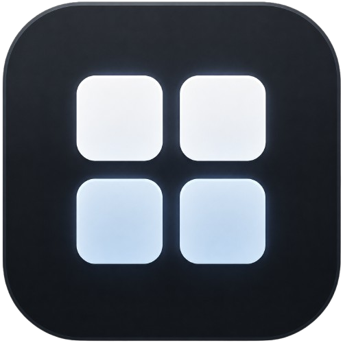
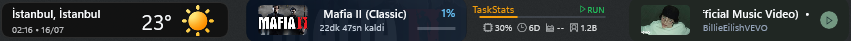
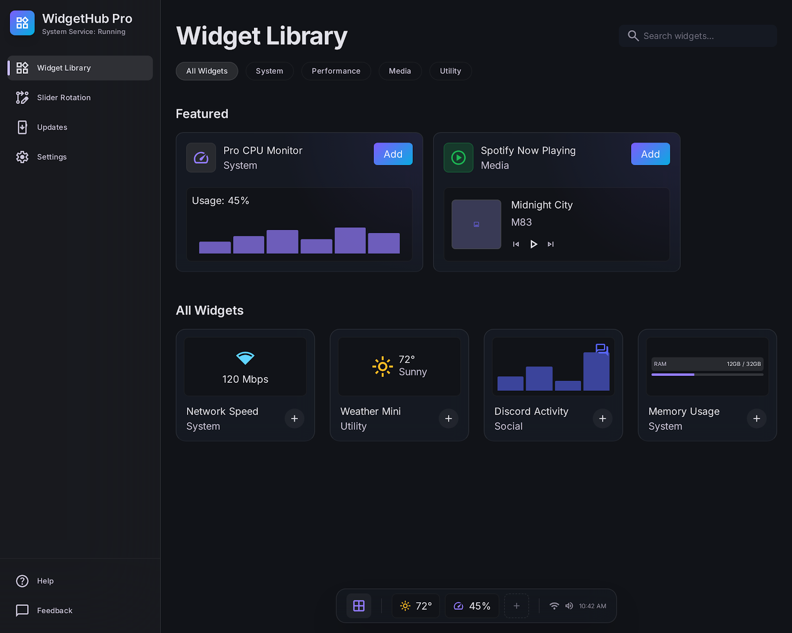
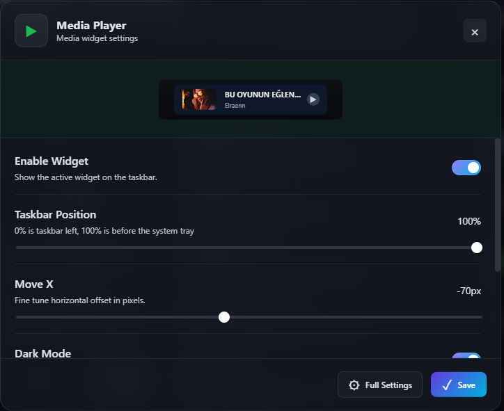

<p align="center">
  
</p>

<h1 align="center">Taskbar Widgets</h1>

<p align="center">
  Live, native-looking widgets for the Windows 11 taskbar.
</p>

<p align="center">
  <a href="https://github.com/pfcdev/TaskbarWidgets/releases/latest"></a>
  
  <a href="LICENSE"></a>
</p>

<p align="center">
  <a href="https://github.com/pfcdev/TaskbarWidgets/releases/latest/download/TaskbarWidgetsSetup-x64.exe"><strong>Download the latest installer</strong></a>
  ·
  <a href="https://github.com/pfcdev/TaskbarWidgets/releases/latest/download/TaskbarWidgets-portable-x64.zip">Portable ZIP</a>
  ·
  <a href="README.tr.md">Türkçe hızlı başlangıç</a>
</p>

<p align="center">
  
</p>

Taskbar Widgets is an open-source Windows 11 x64 application that places useful,
live information directly on the taskbar. Enable several widgets side by side,
position them independently, or cycle through them with the optional rotation
layout. The installer includes the loader, Settings application, native hook,
media helper, and every built-in widget as one product.

> [!WARNING]
> Taskbar Widgets integrates with private Windows 11 XAML surfaces and is still
> beta software. An incompatible taskbar layout disables the integration instead
> of forcing it. Unsigned builds may also trigger a Windows SmartScreen warning.
> Read the [private API risk notes](docs/windows-private-api-risks.md) before use.

## One app for every widget

<p align="center">
  
</p>

The built-in Widget Library shows the real taskbar design before a widget is
enabled. Click anywhere on a widget card to configure it, then add it to the
taskbar from the same screen. Slider Rotation, updates, runtime controls and
global settings are available from the shared Settings application.

## Included widgets

<table>
  <tr>
    <td align="center" width="50%">
      <br />
      <strong>Weather</strong><br />
      Current temperature, city and local forecast with configurable units.
    </td>
    <td align="center" width="50%">
      <br />
      <strong>Steam Downloads</strong><br />
      Active game, download progress, speed and estimated remaining time.
    </td>
  </tr>
  <tr>
    <td align="center" width="50%">
      <br />
      <strong>Codex Status</strong><br />
      Active task state, account information, quota usage and reset windows.
    </td>
    <td align="center" width="50%">
      <br />
      <strong>Media Player</strong><br />
      Current Windows media session, cover art and playback controls.
    </td>
  </tr>
</table>

**Discord Voice** is also included. It shows voice participants and highlights
the current speaker after Discord RPC authorization is configured in Settings.

### System meters

Four lightweight system widgets provide an XMeters-compatible meter layout
using Taskbar Widgets branding and independently implemented native rendering:

- **CPU** shows total, user/privileged, or per-core utilization.
- **Storage** shows read/write throughput for all disks or a selected physical disk.
- **Network** shows receive/send throughput for all adapters or a selected interface.
- **Memory** shows used physical-memory percentage.

Each meter supports text, bar, and pie views, configurable colors, and refresh
intervals from 0.1 to 10 seconds. System meters are disabled by default on
upgrade and can be enabled and positioned independently from the Widget Library.

### Dynamic Media Player themes

The Media Player derives its background, accent and control colors from the
current cover art. These clips are cropped directly from a live taskbar session:

<p align="center">
  
  
  
  <br />
  
  
</p>

### Codex accounts and IDE controls

<table>
  <tr>
    <td width="360" align="center">
      
    </td>
    <td>
      <p>The Codex widget can manage multiple local Codex accounts without leaving the taskbar:</p>
      <ul>
        <li>switch the active account and inspect its current quota;</li>
        <li>start the Codex login flow for a new or existing account;</li>
        <li>remove an account from Taskbar Widgets;</li>
        <li>restart the configured IDE with the active account profile.</li>
      </ul>
      <p><em>Email addresses are intentionally redacted in this screenshot.</em></p>
    </td>
  </tr>
</table>

## Highlights

- Multiple widgets can run together in a configurable row.
- Rotation mode can cycle through a selected widget queue.
- Each widget has independent enable, order, anchor and pixel-offset settings.
- Providers are isolated: one failed integration does not stop the other widgets.
- Settings runs completely from local assets without a CDN or Google Fonts.
- Snapshot writes are atomic and malformed state fails closed at the Explorer boundary.
- The loader automatically recovers after Explorer restarts and supports safe unload/load.
- Legacy TaskbarStats settings, accounts and profiles are migrated without deleting the source.
- The built-in updater downloads only the complete installer and verifies its SHA-256 file.

## Download and install

Taskbar Widgets currently supports **Windows 11 x64**.

| Package | Use case | Download |
| --- | --- | --- |
| Installer | Recommended installation and automatic updates | [TaskbarWidgetsSetup-x64.exe](https://github.com/pfcdev/TaskbarWidgets/releases/latest/download/TaskbarWidgetsSetup-x64.exe) |
| Portable | Manual or self-contained use | [TaskbarWidgets-portable-x64.zip](https://github.com/pfcdev/TaskbarWidgets/releases/latest/download/TaskbarWidgets-portable-x64.zip) |
| Release page | Notes, checksums and release manifest | [Latest GitHub release](https://github.com/pfcdev/TaskbarWidgets/releases/latest) |

1. Download and run `TaskbarWidgetsSetup-x64.exe`.
2. Choose the install directory, Windows startup behavior and shortcut options.
3. Start Taskbar Widgets on the final installer page.
4. Open Settings from the taskbar widget action or run:

```powershell
TaskbarWidgets.exe --settings
```

The default location is:

```text
%LOCALAPPDATA%\Programs\TaskbarWidgets
```

The uninstaller preserves user data unless **Also remove settings and data** is
selected explicitly.

### Verify a download

The installer checksum is always available beside the latest release:

```powershell
$expected = (Invoke-WebRequest "https://github.com/pfcdev/TaskbarWidgets/releases/latest/download/TaskbarWidgetsSetup-x64.exe.sha256").Content.Split()[0]
$actual = (Get-FileHash ".\TaskbarWidgetsSetup-x64.exe" -Algorithm SHA256).Hash.ToLowerInvariant()
$actual -eq $expected
```

## Layout and Settings

The Settings application provides a widget library, per-widget configuration,
taskbar positioning, rotation sequencing, update controls and runtime load/unload.

<p align="center">
  
</p>

- **Row mode:** shows every enabled widget side by side in the configured order.
- **Rotation mode:** shows widgets from a selected queue at a configurable interval.
- **Positioning:** every widget can be dragged directly along the taskbar; the saved anchor percentage and fine pixel offset remain editable and stay synchronized in Settings.
- **Unknown widgets:** remain in configuration but stay disabled until supported.

Settings is an internal component. Users launch `TaskbarWidgets.exe`; they do not
need to install or manage a separate Settings product.

## Data and privacy

Mutable application data is kept under the installed product's `Data` directory:

```text
%LOCALAPPDATA%\Programs\TaskbarWidgets\
  TaskbarWidgets.exe
  TaskbarWidgets.Settings.exe
  TaskbarWidgets.MediaHelper.exe
  Data\
    config.json
    State\
    Commands\
    Accounts\
    Logs\
```

Settings assets are local. Individual integrations may still use the network for
their own data, such as weather requests, Discord authorization, Steam cover art
and update checks. Secrets and account data are not stored in the repository.

## How it works

Taskbar Widgets separates network and account work from Explorer:

```text
Settings UI ──> Data/config.json ──> Loader and providers
     ^                                      │
     │                                      v
Data/Commands/*.json <── actions ── Data/State/*.json
     │                                      │
     └──────────────── Explorer hook <──────┘
```

- The **.NET loader** supervises providers, accounts, commands, migration and updates.
- The **Tauri Settings app** edits configuration through an offline web interface.
- The **native hook** hosts and renders validated snapshots on the Windows taskbar.
- The **media helper** talks to Windows media sessions outside Explorer.

Provider code never executes inside Explorer. Read the full
[architecture](docs/architecture.md) and [widget protocol](docs/protocol.md) for
the runtime boundaries and versioned data contracts.

## Build from source

Requirements:

- Windows 11 x64
- PowerShell 5.1 or newer
- .NET 8 SDK
- Rust stable and Cargo
- Visual Studio 2022 Build Tools with MSVC x64, Windows 11 SDK and CMake
- NSIS 3 for installer packaging

```powershell
git clone https://github.com/pfcdev/TaskbarWidgets.git
cd TaskbarWidgets

.\build.ps1 -Target Verify
.\build.ps1 -Target Build
.\build.ps1 -Target Package -InstallDependencies
```

`VERSION` is the single version source. Build outputs are written under
`artifacts/`. Contributors do **not** need Windhawk. See the detailed
[build guide](docs/building.md) for toolchain and signing information.

## Repository layout

```text
src/loader/       .NET runtime, providers, accounts, commands and updater
src/settings/     Tauri Settings application and offline web UI
src/native/       Explorer hook, taskbar renderer and media helper
widgets/<id>/     widget manifest, provider source and assets
installer/        NSIS installer
build/            validation, build, package, signing and release scripts
docs/             architecture and contributor documentation
tests/            Explorer-independent contract and native tests
```

## Create a widget

Built-in widgets use a source contribution model. Each widget owns a
`widgets/<widget-id>/widget.json` manifest and can provide data through the C#
`IWidgetProvider` contract and render native taskbar UI through the C++ renderer
boundary. Arbitrary external DLLs or executable widget packages are not loaded
in v1.

Start with [Adding a widget](docs/adding-a-widget.md), then review the
[protocol](docs/protocol.md) and [architecture](docs/architecture.md).

## Troubleshooting

- **Widgets are missing:** confirm Windows 11 x64, restart Explorer once and inspect `Data\Logs\loader.log` and `Data\Logs\hook.log`.
- **One integration fails:** inspect `Data\State\<widget-id>.json`; other providers should continue running.
- **Settings does not open:** run `TaskbarWidgets.exe --settings` and verify `TaskbarWidgets.Settings.exe` exists beside it.
- **SmartScreen appears:** compare the installer with the published SHA-256 file before continuing.

More solutions are available in the [troubleshooting guide](docs/troubleshooting.md).

## Contributing and security

Contributions are welcome. Read [CONTRIBUTING.md](CONTRIBUTING.md) before opening
a pull request. Report security issues through the process in
[SECURITY.md](SECURITY.md), not in a public issue.

Taskbar Widgets is released under the [MIT License](LICENSE).

---

<p align="center">
  <a href="https://github.com/pfcdev/TaskbarWidgets/releases/latest/download/TaskbarWidgetsSetup-x64.exe"><strong>Download Taskbar Widgets</strong></a>
  ·
  <a href="https://github.com/pfcdev/TaskbarWidgets/issues">Report an issue</a>
  ·
  <a href="README.tr.md">Türkçe</a>
</p>
