<p align="center">
  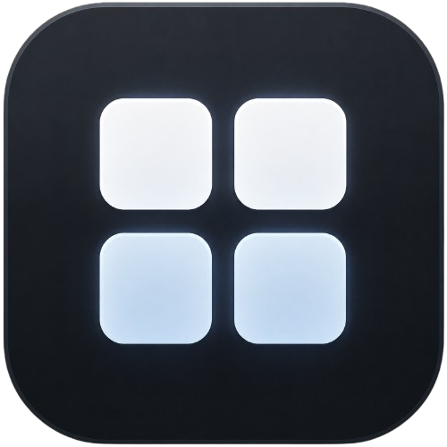
</p>

<h1 align="center">Taskbar Widgets</h1>

<p align="center">
  Useful, live widgets that feel at home on the Windows 11 taskbar.
</p>

<p align="center">
  <a href="https://github.com/pfcdev/TaskbarWidgets/releases/latest"></a>
  <a href="https://github.com/pfcdev/TaskbarWidgets/releases"></a>
  
  <a href="LICENSE"></a>
</p>

<p align="center">
  <a href="https://github.com/pfcdev/TaskbarWidgets/releases/latest/download/TaskbarWidgetsSetup-x64.exe"></a>
</p>

<p align="center">
  <a href="https://github.com/pfcdev/TaskbarWidgets/releases/latest">Release notes</a>
  ·
  <a href="https://github.com/pfcdev/TaskbarWidgets/releases/latest/download/TaskbarWidgets-portable-x64.zip">Portable ZIP</a>
  ·
  <a href="README.tr.md">Türkçe</a>
</p>

<p align="center">
  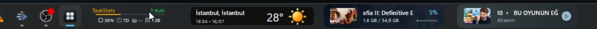
</p>

Taskbar Widgets is a free, open-source app for **Windows 11 x64**. It puts useful
information and controls directly on your taskbar without replacing the Windows
shell. Choose only the widgets you want, arrange them by dragging, and manage
everything from one Settings app.

> [!IMPORTANT]
> Taskbar Widgets is beta software and integrates with private Windows 11 XAML
> surfaces. A Windows update may temporarily affect compatibility. If the
> current taskbar layout is unsupported, the integration disables itself instead
> of forcing a potentially unstable layout.

## See it in action

<table>
  <tr>
    <td align="center">
      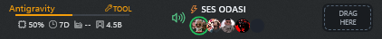<br />
      <strong>Work and communication</strong>
    </td>
    <td align="center">
      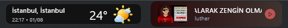<br />
      <strong>Weather and media</strong>
    </td>
  </tr>
  <tr>
    <td align="center">
      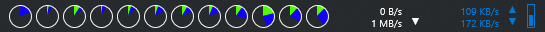<br />
      <strong>Live system monitoring</strong>
    </td>
    <td align="center">
      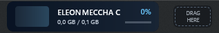<br />
      <strong>Downloads and quick file parking</strong>
    </td>
  </tr>
</table>

## Get started

1. [Download the latest installer](https://github.com/pfcdev/TaskbarWidgets/releases/latest/download/TaskbarWidgetsSetup-x64.exe).
2. Run the installer and leave **Start Taskbar Widgets** selected on the final page.
3. Open the notification-area icon and choose **Open Settings**.
4. Enable the widgets you want, then drag them directly along the taskbar.

The app starts with Windows when that option is selected during installation.
You can later enable or disable all widgets from the notification-area menu
without uninstalling anything.

> [!NOTE]
> Unsigned beta releases may show a Windows SmartScreen warning. The release page
> includes a SHA-256 checksum so you can verify the installer before running it.

## One Settings app, every widget

<p align="center">
  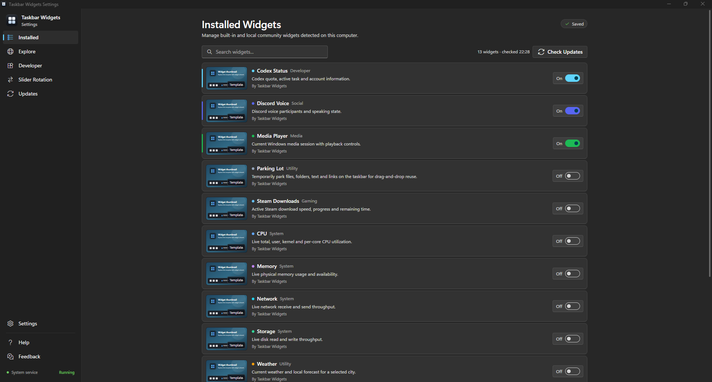
</p>

The Widget Library is the central place to:

- enable, disable and configure widgets;
- choose a taskbar position for each widget;
- switch between side-by-side and rotation layouts;
- install Community widgets and review their permissions;
- check for updates and control the taskbar runtime.

Widgets can also be moved directly on the taskbar. Collision-aware placement
keeps them away from one another and from taskbar app buttons while dragging.

## Built-in widgets

<table>
  <tr>
    <td align="center" width="50%">
      <br />
      <strong>Weather</strong><br />
      Current temperature, location and weather conditions with Celsius or Fahrenheit units.
    </td>
    <td align="center" width="50%">
      <br />
      <strong>Steam Downloads</strong><br />
      Active game, progress, transfer speed and download size.
    </td>
  </tr>
  <tr>
    <td align="center" width="50%">
      <br />
      <strong>Codex Status</strong><br />
      Active Antigravity/Codex work, quota information and local account controls.
    </td>
    <td align="center" width="50%">
      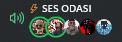<br />
      <strong>Discord Voice</strong><br />
      Voice-room participants, mute state and a green ring around the current speaker.
    </td>
  </tr>
  <tr>
    <td align="center" width="50%">
      <br />
      <strong>Media Player</strong><br />
      The current Windows media session, cover art and play/pause control.
    </td>
    <td align="center" width="50%">
      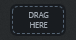<br />
      <strong>Parking Lot</strong><br />
      Temporarily hold files, folders, links or text and drag them out again when needed.
    </td>
  </tr>
  <tr>
    <td align="center" width="50%">
      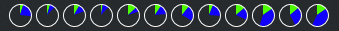<br />
      <strong>CPU</strong><br />
      Total or per-core activity using compact text, bars or pie meters.
    </td>
    <td align="center" width="50%">
      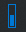<br />
      <strong>Memory</strong><br />
      Live physical-memory usage in a minimal taskbar meter.
    </td>
  </tr>
  <tr>
    <td align="center" width="50%">
      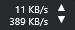<br />
      <strong>Storage</strong><br />
      Read and write throughput for all disks or a selected drive.
    </td>
    <td align="center" width="50%">
      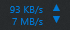<br />
      <strong>Network</strong><br />
      Live upload and download throughput for all or selected network adapters.
    </td>
  </tr>
</table>

System meters support configurable colors and refresh intervals from 0.1 to 10
seconds. Each one is independent, so you can use a single tiny meter or combine
several into a compact monitoring strip.

## Discord Voice, without modifying Discord

Discord Voice reads the selected voice room and participant information from the
normally running Discord desktop window. It does **not** patch Discord, inject
code into it, require a bot, or ask for an OAuth login.

For faster speaking-ring updates, Settings can install the optional **Instant
Speaking Detection** Windows helper. Windows asks for administrator permission
only when this helper is installed or removed. The helper detects speaking
start/stop timing; it does not listen to, record or store call audio.

Two layouts are available:

- **Avatars:** a minimal row of participant avatars.
- **Voice room:** room title and compact participant avatars below it.

## Parking Lot

Parking Lot is a small drag-and-drop shelf on the taskbar. Drop a file, folder,
web link or text onto it, switch between parked items with a click, and drag the
selected item into another folder or application later. Right-click it to remove
the current item or clear the shelf.

The widget stores references locally. It does not upload parked content.

## Dynamic Media Player themes

The Media Player adapts its background, accent and controls to the current cover
art. These examples were captured from live Windows media sessions:

<p align="center">
  
  
  
  <br />
  
  
</p>

## Codex accounts and IDE controls

<table>
  <tr>
    <td width="360" align="center">
      
    </td>
    <td>
      <p>The Codex widget can manage multiple local Codex accounts from the taskbar:</p>
      <ul>
        <li>switch the active account and inspect its quota;</li>
        <li>start the Codex login flow;</li>
        <li>remove an account from Taskbar Widgets;</li>
        <li>restart the configured IDE with the active profile.</li>
      </ul>
      <p><em>Email addresses are intentionally redacted in this screenshot.</em></p>
    </td>
  </tr>
</table>

## Layout and everyday controls

<p align="center">
  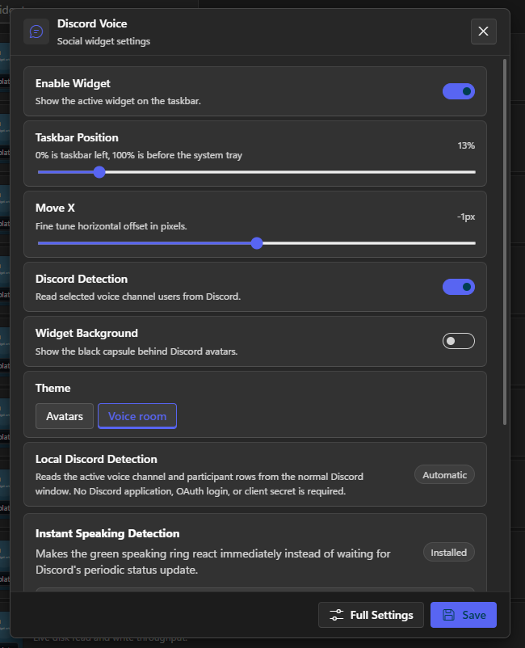
</p>

- **Side by side:** show multiple enabled widgets at once.
- **Rotation:** cycle through a chosen list at a configurable interval.
- **Direct positioning:** drag a widget along the taskbar and its position is saved automatically.
- **Notification-area menu:** open Settings or enable/disable widgets quickly.
- **Explorer recovery:** the app restores its taskbar and notification-area integration after Explorer restarts.

## Community widgets

Taskbar Widgets can install `.twidget` packages made with the Community SDK.
Before installation, Settings shows the widget's author, requested permissions
and security level. Community web widgets run outside Explorer in a separate,
restricted renderer, and optional full-access widgets must clearly explain why
they need additional permissions.

Only install Community widgets from authors you trust. Removing one does not
affect built-in widgets or the rest of the app.

## Download options

| Package | Best for | Download |
| --- | --- | --- |
| Installer | Recommended setup, startup integration and updates | [TaskbarWidgetsSetup-x64.exe](https://github.com/pfcdev/TaskbarWidgets/releases/latest/download/TaskbarWidgetsSetup-x64.exe) |
| Portable ZIP | Manual or self-contained use | [TaskbarWidgets-portable-x64.zip](https://github.com/pfcdev/TaskbarWidgets/releases/latest/download/TaskbarWidgets-portable-x64.zip) |
| Release page | Release notes, checksums and all assets | [Latest GitHub release](https://github.com/pfcdev/TaskbarWidgets/releases/latest) |

The default installer location is:

```text
%LOCALAPPDATA%\Programs\TaskbarWidgets
```

The uninstaller keeps your settings and widget data unless **Also remove settings
and data** is selected.

### Verify the installer

Download the `.sha256` file from the same release, or verify it with PowerShell:

```powershell
$expected = (Invoke-WebRequest "https://github.com/pfcdev/TaskbarWidgets/releases/latest/download/TaskbarWidgetsSetup-x64.exe.sha256").Content.Split()[0]
$actual = (Get-FileHash ".\TaskbarWidgetsSetup-x64.exe" -Algorithm SHA256).Hash.ToLowerInvariant()
$actual -eq $expected
```

## Data and privacy

Settings, widget configuration, cached images and runtime state stay on your PC.
The default data directory is:

```text
%LOCALAPPDATA%\Programs\TaskbarWidgets\Data
```

Some widgets contact their own data sources—for example weather services,
release checks or cover-art endpoints. Provider work runs outside Explorer, and
one failed integration does not stop the other widgets. Secrets and account data
are never stored in this repository.

## Troubleshooting

- **No widgets appear after installation:** start Taskbar Widgets from the Start menu, then check the notification-area icon. If needed, restart Explorer once.
- **A widget is missing:** open Settings and confirm that the widget is enabled.
- **Settings does not open:** run `TaskbarWidgets.exe --settings` from the installation folder.
- **Discord speaking rings update slowly:** enable **Instant Speaking Detection** in Discord Voice settings.
- **SmartScreen appears:** verify the installer against the published SHA-256 file before continuing.

More solutions are available in the [troubleshooting guide](docs/troubleshooting.md).

<details>
<summary><strong>Developer documentation and building from source</strong></summary>

### Architecture and widget development

- [Architecture](docs/architecture.md)
- [Widget protocol](docs/protocol.md)
- [Adding a built-in widget](docs/adding-a-widget.md)
- [Community SDK](community-sdk/README.md)
- [Private Windows API risk notes](docs/windows-private-api-risks.md)

### Build requirements

- Windows 11 x64
- PowerShell 5.1 or newer
- .NET 8 SDK
- Rust stable and Cargo
- Visual Studio 2022 Build Tools with MSVC x64, Windows 11 SDK and CMake
- NSIS 3 for installer packaging

```powershell
git clone https://github.com/pfcdev/TaskbarWidgets.git
cd TaskbarWidgets

.\build.ps1 -Target Verify
.\build.ps1 -Target Build
.\build.ps1 -Target Package -InstallDependencies
```

See the [build guide](docs/building.md) for toolchain and signing details.

</details>

## Contributing and security

Contributions are welcome. Read [CONTRIBUTING.md](CONTRIBUTING.md) before opening
a pull request. Report security issues through [SECURITY.md](SECURITY.md), not in
a public issue.

Taskbar Widgets is released under the [MIT License](LICENSE).

---

<p align="center">
  <a href="https://github.com/pfcdev/TaskbarWidgets/releases/latest/download/TaskbarWidgetsSetup-x64.exe"><strong>Download Taskbar Widgets</strong></a>
  ·
  <a href="https://github.com/pfcdev/TaskbarWidgets/releases/latest">Release notes</a>
  ·
  <a href="https://github.com/pfcdev/TaskbarWidgets/issues">Report an issue</a>
</p>
